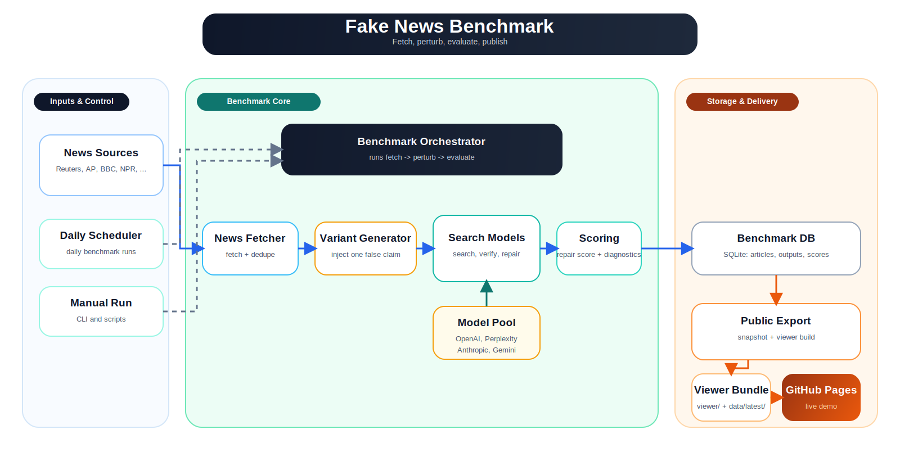

# Fully vibe-coded: Daily Fake News LLM Benchmark


A comprehensive benchmarking system for evaluating LLM performance in detecting and correcting fake news. The system automatically fetches top news stories, generates fake versions through controlled modifications, and evaluates multiple LLMs' ability to detect and correct misinformation.

## High-Level System

[](docs/high-level-system.drawio)

Editable source: [docs/high-level-system.drawio](docs/high-level-system.drawio)

## Features

- Daily automated news fetching from reliable sources
- Controlled fake news generation through entity, date/time, location, and number modifications
- Real-time LLM evaluation using Together.ai plus web-grounded search models
- Search-grounded benchmarking support for OpenAI, Perplexity, Anthropic, and Gemini models
- Static viewer publishing for GitHub Pages via `viewer/` + `data/latest/`
- Only perturbed articles are published; articles that fail modification are skipped for now
- One-command local end-to-end runs with local keys and public-safe export steps
- Multiple evaluation metrics:
  - Surface alignment metrics (NLI, semantic similarity, lexical distance)
  - Targeted repair scoring that checks whether a model actually reverses the injected falsehood
  - Repair-rate diagnostics that show when a model preserves the fake claim, drops it, or fixes it with commentary
- Beautiful web interface with:
  - Interactive charts
  - Sortable tables
  - Detailed result views
- Daily scheduled updates at 9 AM

## Setup

1. Clone the repository:
```bash
git clone https://github.com/Isydmr/web-search-tool-benchmark.git
cd web-search-tool-benchmark
```

2. Create a virtual environment and install dependencies:
```bash
python -m venv venv
source venv/bin/activate  # On Windows: venv\Scripts\activate
pip install -r requirements.txt
```

3. Install spaCy model:
```bash
python -m spacy download en_core_web_sm
```

4. Create a .env file with your API keys:
```
TOGETHER_API_KEY=your_together_api_key
OPENAI_API_KEY=your_openai_api_key
PERPLEXITY_API_KEY=your_perplexity_api_key
ANTHROPIC_API_KEY=your_anthropic_api_key
GEMINI_API_KEY=your_gemini_api_key
SCHEDULER_ENABLED=0
ENABLED_WEB_SEARCH_MODELS=gpt-5.4,perplexity:sonar,claude-sonnet-4-6,gemini-3.1-pro-preview
```

`ENABLED_WEB_SEARCH_MODELS` accepts comma-separated aliases or provider-qualified IDs. Set it to `all` to run every registered web-search model that has credentials configured.

`GEMINI_API_KEY` is preferred; `GOOGLE_API_KEY` is also accepted for backward compatibility.

Default web-search models:

- `gpt-5.4`
- `perplexity:sonar`
- `claude-sonnet-4-6`
- `gemini-3.1-pro-preview`

Currently registered web-search models include:

- OpenAI: `gpt-5.4`, `gpt-5`, `gpt-4o-search-preview`, `gpt-4o-mini-search-preview`
- Perplexity: `perplexity:sonar` (alias: `sonar`), `sonar-pro`, `sonar-reasoning-pro`, `sonar-deep-research`
- Anthropic: `claude-opus-4-6`, `claude-opus-4-5-20251101`, `claude-opus-4-1-20250805`, `claude-sonnet-4-6`, `claude-sonnet-4-5-20250929`, `claude-sonnet-4-20250514`, `claude-haiku-4-5-20251001`
- Google Gemini: `gemini-3.1-pro-preview`, `gemini-2.5-flash`, `gemini-2.5-pro`

5. Run the full local benchmark and publish the static viewer snapshot:
```bash
./scripts/run_end_to_end.sh --serve
```

Then open `http://localhost:8877/viewer/index.html`.

6. Optional: run the FastAPI app without auto-starting the scheduler:
```bash
python -m app.main
```

The FastAPI app will be available at http://localhost:8080

## Static Viewer and GitHub Pages

- Public-safe artifacts live in `viewer/` and `data/latest/`
- Local run history lives in `runs/<run_id>/` and is ignored by git
- `scripts/publish_latest_to_viewer.py` exports a whitelist of public fields from sqlite instead of publishing the live database
- `scripts/build_pages_site.py` creates a minimal `site/` bundle, and `.github/workflows/deploy-pages.yml` deploys that bundle to GitHub Pages
- `scripts/run_end_to_end.sh` defaults to `--publish-mode auto`, which uses supplemental merge when `data/latest/` already exists

## Project Structure

```
web-search-tool-benchmark/
├── .github/workflows/deploy-pages.yml
├── README.md
├── index.html
├── requirements.txt
├── viewer/
│   └── index.html         # Static GitHub Pages viewer
├── data/
│   └── latest/            # Published static dataset
├── scripts/
│   ├── run_end_to_end.sh
│   ├── run_benchmark_once.py
│   ├── publish_latest_to_viewer.py
│   └── build_pages_site.py
├── app/
│   ├── __init__.py
│   ├── main.py              # FastAPI application
│   ├── config.py            # Configuration settings
│   ├── scheduler.py         # Daily task scheduler
│   ├── components/
│   │   ├── news_fetcher.py  # News fetching logic
│   │   ├── news_modifier.py # Fake news generation
│   │   ├── llm_evaluator.py # LLM evaluation
│   │   └── evaluation.py    # Evaluation metrics
│   ├── models/
│   │   ├── news.py         # Database models
│   │   └── database.py     # Database configuration
│   └── templates/
│       └── index.html      # Web interface
└── runs/                    # Local-only run history (gitignored)
```

## Contributing

1. Fork the repository
2. Create a feature branch
3. Commit your changes
4. Push to the branch
5. Create a Pull Request

## License

This project is licensed under the MIT License - see the LICENSE file for details.
